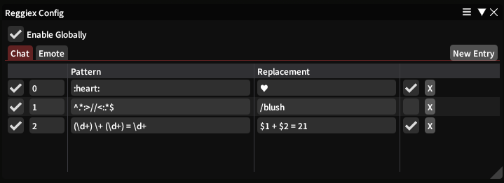

# Reggiex

Dalamud plugin providing configurable text patterns for substitutions or command executions.

Installable using my custom repository (instructions here: https://github.com/anya-hichu/DalamudPluginRepo) or from compiled archives.

## Commands

- `/reggiex config` - Open config window
- `/reggiex enable` - Enable plugin
- `/reggiex disable` - Disable plugin

## Screenshots

